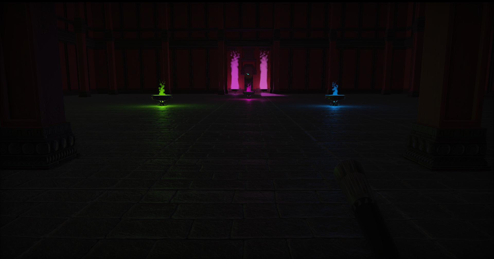
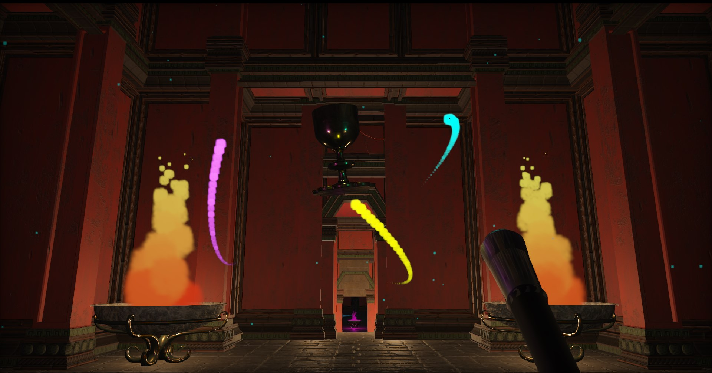
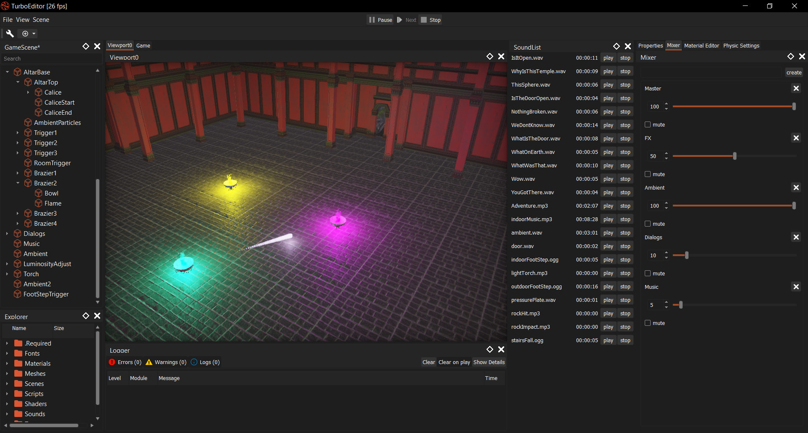
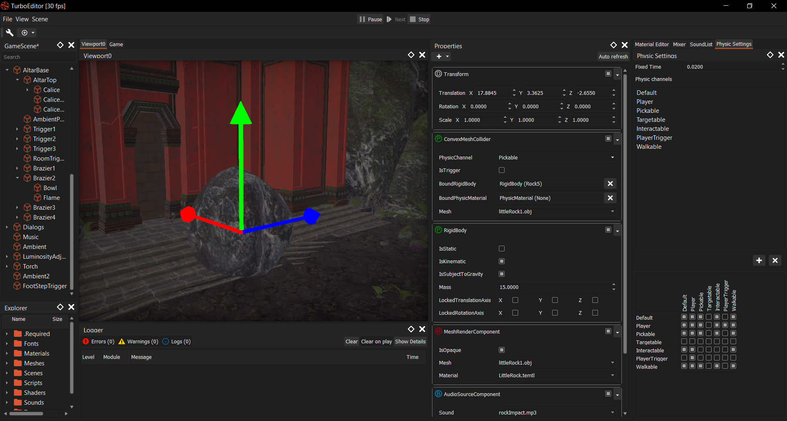
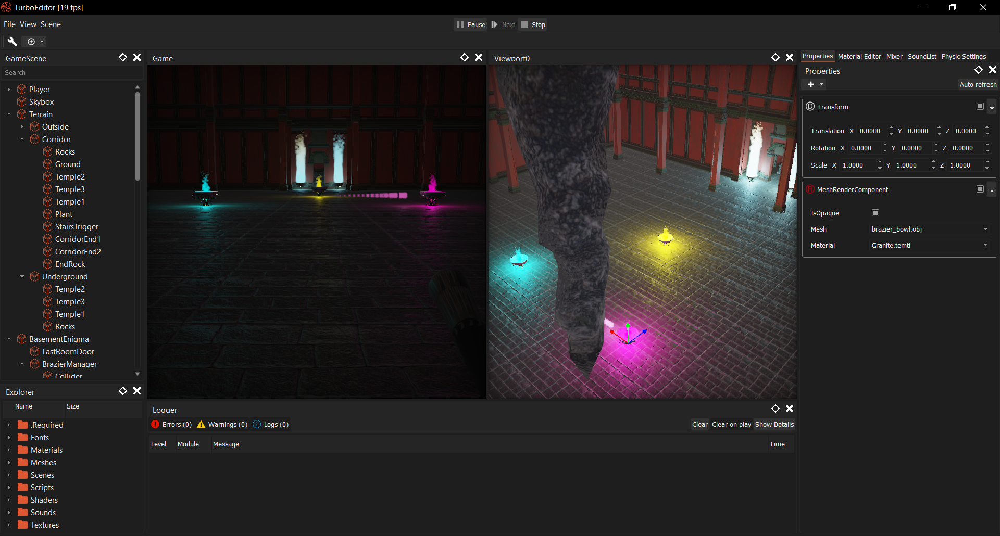
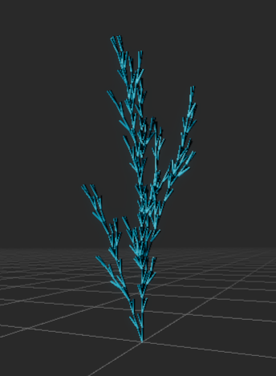

### Student projects - [Personal projects](personal_projects)

 

# Student Projects

 

## TurboEngine
* Duration: ~6 months.  
* Made by: Julien Soysouvanh, Clément Fazilleau, Basile Combet, Grégoire Penon.  
> A full featured game engine with editor, built with Qt, OpenGL, PhysX, Fmod, ...  
> Features: C++ scripting with hotReload, lua scripting, 3D spatialized sound support, PBR rendering, particles systems, rigidbodies, project save, ...

__My work:__  
Full sound implementation with Fmod, sound widgets (sound mixer listenInEditor), Debug system (custom logger, exceptions, stacktrace, ...),   
work on general architecture (ecs, RHI, ...), serialization, partial Lua Binding.  

<iframe width="560" height="315" src="https://www.youtube.com/embed/gQB3Qrx4oFI" frameborder="0" allow="accelerometer; autoplay; encrypted-media; gyroscope; picture-in-picture" allowfullscreen></iframe>

 

<iframe width="560" height="315" src="https://www.youtube.com/embed/8lSzQ4YnoVc" frameborder="0" allow="accelerometer; autoplay; encrypted-media; gyroscope; picture-in-picture" allowfullscreen></iframe>

 

 

 

 

 

---

## Messy robbery 
* Duration: ~6 months.
* Made by: 
  * Artists: Goldie BISEGNA, Calvin DONG & Constance TRAN.
  * Game designers:  Pauline DELCROIX, Tiphanie TIMORES & Arthur TORDJEMAN.
  * Composer & sound designer: Adam GONCALVES.
  * Programmers: Pierre AUMONT, José manuel CHAO CATALÁ & Gregoire PENON.
* Link: [https://isart-digital.itch.io/messyrobbery](https://isart-digital.itch.io/messyrobbery)
> Messy robbery is a 4 players party game made with unity inspired by titles like moving out and overcooked. 

__My work:__
Character controller, grab / launch mechanic, dash, physics tweaking,debugging, various removed features.

---

## Lambo's tale
* Duration: 4 weeks
* Made by: 
  * Artists: Jade PERDRILLAT, Mélanie L'HUILLIER, Salomé LYSIMAQUE CHAPUIS.
  * Game designers: Max DROULEZ, Adrien BORDES, Grégory RUMEBE, Tony ZHANG.
  * Programmers: Julien SOYSOUVANH, Philippe YI, Grégoire PENON, Clément FAZILLEAU.

* Link: [https://cfaz.itch.io/lambos-tale](https://cfaz.itch.io/lambos-tale)
> Lambo’s Tale is a 2D platformer made with Unity implementing Metroidvania mechanics. And procedural level generation.  

__My work:__
Full character controller, character skills, debugging.

--- 

## Ball'Nimals
* Duration: 4 days.
* Made by:   
  * Artists: Jeane Plouvenez, Jade Perdrillat, Noémie Dumont, Victor Lopez.  
  * Programmers: Lucas Forcina, Grégoire Penon.  
  * Game designers: Stephane Traut.  
  * Sound designers: Kevin Dedou.  
> A casual mobile game made with Unity.

__My work:__  
Implementation of the capture feature, various other features (pet animals, favourite and eat features, ...), debugging, ... 

<iframe width="560" height="315" src="https://www.youtube.com/embed/B-cegJ96LQY" frameborder="0" allow="accelerometer; autoplay; encrypted-media; gyroscope; picture-in-picture" allowfullscreen></iframe>

---

## Unity L-System tool
* Duration: ~ 2 weeks.  
R&D projects on L-Systems. Creation of an Unity tool that can interpret an L-System language and generate meshes.  
  

---

## Gladiator
* Duration: 3 weeks.  
* Made by: Alexis Beracochea, Grégoire Penon.  
> A 3D combat-based game with AI on Unreal Engine 4, mostly written in C++ and blueprint for UI and other small parts.

__My work:__  
AI with Unreal Engine 4 behavior trees, player attack, UI.

<iframe width="560" height="315" src="https://www.youtube.com/embed/8AxwOHNeTm4" frameborder="0" allow="accelerometer; autoplay; encrypted-media; gyroscope; picture-in-picture" allowfullscreen></iframe>

---

## Aether Ego
* Duration 1 month.
* Made by: 
  * Programmers: José Chao Catalá, Bryan Kitihoun, Grégoire Penon.
  * Game desiners: Pauline Delcroix, Paul Fougues, Erwan Maupas, Bastien Cruette, Thibault Legouet.  
> A 3D infiltration game made with Unity.

__My work:__  
Work on field of views, Ghost controls / interactions, sound waves feature.

<iframe width="560" height="315" src="https://www.youtube.com/embed/R4-oihKdMvY" frameborder="0" allow="accelerometer; autoplay; encrypted-media; gyroscope; picture-in-picture" allowfullscreen></iframe>

---

## OpenGL FPS
* Duration 1 month.
* Made by: José Chao Catalá, Pierre Aumont, Lubin Groussat, Grégoire Penon.   
> A 3D FPS on OpenGL, with custom physics / collisions.  

__My work:__  
Work on Full engine : Engine architecture, Rendering with OpenGL, custom math library, physics, obj loader, logger, ...

 

--- 

 

__All the projects above, are student projects made at__ [Isart Digital](https://www.isartdigital.com/fr/).  

