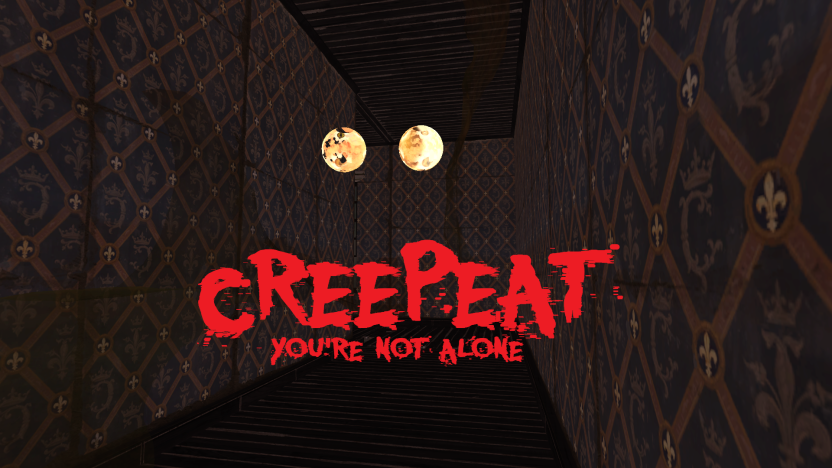

### [Student projects](index) - Personal projects

# Personal projects

 

## [Creepeat](https://ironax.itch.io/creepeat)
* Duration: 72h.  
* Made by: Pierre Aumont, Matthieu Ronarc'h, Mehdi Ouzerout, José Manuel Chao Catalá, Grégoire Penon.

> An horror game where you must use your voice to locate your enemy.  
> Made under 72h for [Quarantine game jam](https://itch.io/jam/gamefreelaejob-jam).  
> [Winner](https://www.facebook.com/groups/gamefreelaejobs/permalink/2519770484936476/) of Quarantine game jam.

--- 

## [Little Bird Blog](https://blackbird806.github.io/LittleBirdBlog/)

> A little programming and gamdev blog.